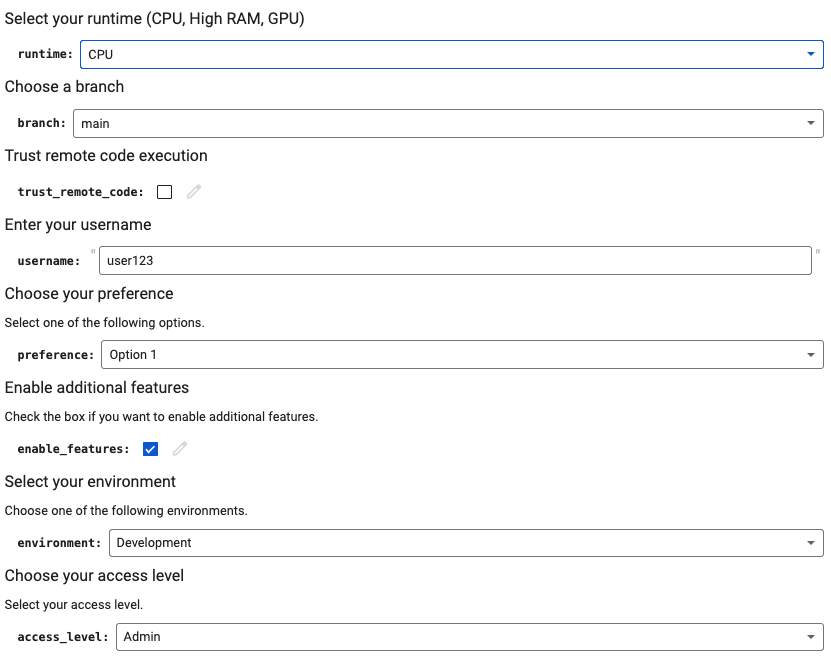

# Collab UI Elements

## Notes

- [ ] Runtime Dropdown: Allows the user to select the runtime type.
- [ ] Branch Dropdown: Allows the user to select the branch.
- [ ] Boolean Checkbox: For trusting remote code execution.
- [ ] Textbox: For entering the username.
- [ ] Dropdown for Preferences: Allows the user to select one of several options.
- [ ] Boolean Checkbox: For enabling additional features.
- [ ] Environment Dropdown: Allows the user to select the environment (Development, Staging, Production).
- [ ] Radio Buttons for Access Level: Allows the user to select an access level (Admin, User, Guest).
	The @param annotation with {type:"string"} can be used to create a radio button group in Google Colab. The user can select only one option from the group.

Adapt and expand these examples based on your specific needs. Each input element can be customized with additional options, labels, and default values to suit different use cases.
